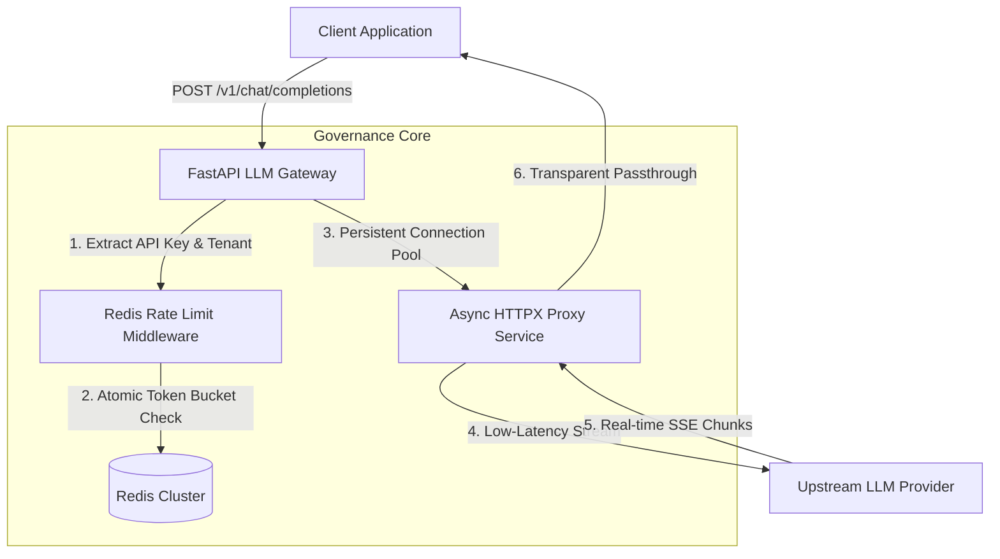

<div align="center">

#   Enterprise LLM Gateway & Token Governance Proxy

**An ultra-low-latency, asynchronous LLM reverse proxy and multi-tenant token governance engine engineered for production environments.**

[](https://www.python.org/downloads/)
[](https://fastapi.tiangolo.com/)
[](https://redis.io/)
[](https://opensource.org/licenses/MIT)

</div>

---

##   Overview

Most AI applications tie business logic directly to third-party LLM APIs, creating severe bottlenecks: unmanaged rate limits, runaway token costs, and synchronous request blocking. 

**`llm-gateway-proxy`** acts as an enterprise-grade middleware shield. It provides secure multi-tenant routing, asynchronous Server-Sent Events (SSE) streaming passthrough, and atomic distributed rate limiting using Redis.

---

##   Architecture & Request Lifecycle



##   Key Technical Highlights
Asynchronous Concurrency: Built on httpx.AsyncClient utilizing persistent connection pooling, eliminating TCP handshake overhead across high-frequency requests.

Zero-Latency Stream Passthrough: Implements asynchronous generators (aiter_bytes) to stream Server-Sent Events (SSE) token chunks directly back to clients with zero memory buffering bloat.

Atomic Distributed Rate Limiting: Avoids race conditions across multi-instance horizontal deployments by combining Redis pipelines with sliding-window calculations.

Fail-Open Availability: Engineered with circuit-breaking fallback logic—if the Redis cluster experiences downtime, the gateway fails open to protect core application uptime.

##   Project Architecture

```text
llm-gateway-proxy/
├── 📁 src/
│   ├── 📁 api/             # API versioning & request routers
│   ├── 📁 core/            # Application configuration & database sessions
│   ├── 📁 middleware/      # Tenant authentication & Redis rate-limiting
│   ├── 📁 services/        # Async HTTP proxy & SSE streaming execution
│   └── 📄 main.py          # FastAPI application entrypoint & lifecycle
├── 📁 tests/               # Pytest suite & HTTP mocking (respx)
├── 🐳 Dockerfile           # Optimized multi-stage container build
├── 🐳 docker-compose.yml   # Local orchestration stack (App + Redis)
└── 📦 pyproject.toml       # Modern Python packaging & dependencies
```

##   Quickstart Guide

### 1. Clone & Set Up Environment
```bash
git clone [https://github.com/Valentina14142000/llm-gateway-proxy.git](https://github.com/Valentina14142000/llm-gateway-proxy.git)
cd llm-gateway-proxy

Initialize and activate virtual environment
python -m venv venv
source venv/bin/activate  # On Windows use: .\venv\Scripts\Activate

Install package with development dependencies
pip install -e ".[dev]"
```

### 2. Run Containerized Stack (App + Redis)
```Bash
docker compose up --build
```

### 3. Execute Test Suite
```Bash
pytest -v
```

